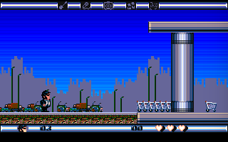
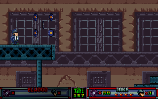

# Blues Brothers

This is a rewrite of the [Blues Brothers](https://www.mobygames.com/game/blues-brothers) and [Blues Brothers: Jukebox Adventure](https://www.mobygames.com/game/blues-brothers-jukebox-adventure) game engines developed by [Titus Interactive](https://www.mobygames.com/company/titus-interactive-sa).

 

There is also support for [Prehistorik 2](https://www.mobygames.com/game/prehistorik-2).

## Requirements

### Blues Brothers

The data files of the Amiga or DOS version, full game or [demo](https://archive.org/details/TheBluesBrothers_1020), are required.

```
*.BIN, *.CK1, *.CK2, *.SQL, *.SQV, *.SQZ
```

For sounds and music, the Amiga version files or the [ExoticA](https://www.exotica.org.uk/wiki/The_Blues_Brothers) set need to be copied.

### Jukebox Adventure

The data files of the DOS version are required.

```
*.EAT, *.MOD
```

### Prehistorik 2

The data files of the DOS version, full game or [demo](http://cd.textfiles.com/ccbcurrsh1/demos/pre2.zip), are required.

```
*.SQZ, *.TRK
```

## Changes

Compared to the original DOS executables, the rewritten engines feature :

- horizontal scrolling
- configurable screen size
- game cheats : unlimited lifes and energy, no hit


## Running

By default, the executable loads the data files from the current directory.
This can be changed using command line switches.

```
Usage: blues [OPTIONS]...
  --datapath=PATH   Path to data files (default '.')
  --level=NUM       Start at level NUM
  --cheats=MASK     Cheats bitmask
  --startpos=XxY    Start at position (X,Y)
  --fullscreen      Enable fullscreen
  --scale=N         Graphics scaling factor (default 2)
  --filter=NAME     Graphics scaling filter (default 'nearest')
  --screensize=WxH  Graphics screen size (default 320x200)
  --cga             Enable CGA colors
```

## Downloads

[blues-sdl2-win32.zip](https://www.dropbox.com/s/vv8mh0vrk8l6xro/blues-gh-sdl2-win32.zip?dl=0) - Win32 executable
